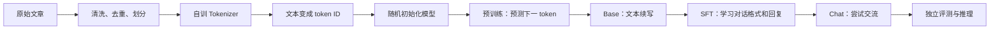

# 从零训练小模型：初学者阅读路线

如果你刚接触 LLM，先理解我们为什么做这些实验，再看训练命令。读完这一页，应能回答：数据怎样变成模型、为什么模型会续写却不一定会聊天、每个实验替下一步排除了什么问题。

## 先建立一个完整画面

语言模型每次预测一个 token。给它“今天的天气”，它会给词表里的各个 token 打分，选择下一个，接着把新 token 放回输入，再预测一次。训练时我们已经知道原文的下一个 token，用预测与原文的差距调整模型参数。

Tokenizer 的训练只使用训练文档。验证和测试文档也用同一个 Tokenizer 编码，但不参与它的训练。模型的权重则从随机数开始；使用现成训练框架不等于加载现成模型的知识。

## 为什么不直接把四张卡全部开起来训练？

一次长训练会同时依赖数据、模型、梯度、分布式、保存恢复和评测。若直接跑很久后效果很差，很难判断是哪一环有问题。因此实验按“逐步排除问题”安排。

| 阅读顺序 | 要回答的问题 | 做完后可以相信什么 |
|---|---|---|
| [运行与网络](00_environment.md) | 数据和环境能稳定准备吗？ | 路径、环境和下载方式可追踪 |
| [模型原理](01_foundations.md) | 一个 batch 怎样更新参数？ | 理解输入、预测、loss、梯度的关系 |
| [基础复现](02_reproduction.md) | 小模型能学到东西吗？哪些参数值得调整？ | 训练链路和对照实验有效 |
| [数据与 Tokenizer](03_data_tokenizer.md) | 模型看到的究竟是什么？ | 编码一致，验证不混入训练 |
| [分布式与性能](04_distributed.md) | 多卡算得对吗？真的更快吗？ | 梯度、尾部、恢复先通过，再谈速度 |
| [正式预训练](05_pretraining.md) | 更多唯一文本能否改善续写？ | 获得一个可评估的 Base 模型 |
| [聊天后训练](06_sft.md) | 如何从续写变成回答用户？ | 训练目标与聊天格式对齐 |
| [评测与推理](07_evaluation_inference.md) | 模型是否真的完成了请求？ | 用固定题目与真实回答判断能力 |

不必一次理解所有代码。先读每页的“问题、设计、结论”，再沿着该页给出的入口阅读实现。陌生名词查 [术语表](glossary.md)，实验细节查 [实验导航](../experiments/README.md)。

## 三类结果必须分开看

1. **实现正确**：例如一次四卡更新与单卡更新接近，保存后恢复结果一致。
2. **训练有进展**：例如固定验证集上的 loss 下降。
3. **能力达标**：例如摘要保留事实、按要求改写、三轮对话记得前文。

前一类通过，不会自动推出后一类。我们的 100M-token 213M pilot 已能正常训练和导出，验证 loss 也下降，但续写仍明显重复。这是一个很有价值的反例：日志“变好”与用户“觉得好用”之间，还有正式预训练、SFT 和语义评测。

## 怎样读一份实验报告？

依次找六个答案：要解决什么问题？为什么现在做？只改变了哪些变量？其他条件怎样保持一致？实际结果是什么？结果能支持什么、不能支持什么？

例如，学习率实验让几组模型读同样数量的 token，使用相同数据和验证集，主要改变学习率。这样才有理由把结果差异与学习率联系起来。若同时更换模型、Tokenizer 和语料，就不能把差异都归因于某一个改动。

[历史报告](../experiments/README.md) 与 [本次运行记录](results.md) 是两批不同运行。历史结果是学习材料，不是当前训练已经完成的证明。本轮最终结果以 [最终交付](final_delivery.md) 为准；旧自动阶段表与 `workflow.json` 记录早期控制器流程，不能代替最终 v2 的语义审阅结果。

## 第一次动手的方式

先运行 M0 的小语料过拟合实验，观察 loss 如何下降，然后阅读保存与加载的代码。第二次再理解 39M 的独立验证。最后才进入四卡和数十亿 token 的正式训练。

阅读文档和日志可以随时进行；本轮训练和验收已收尾，不需要为了阅读再次执行完整训练命令。重跑实验时使用新的输出目录，保留原结果作对照。
