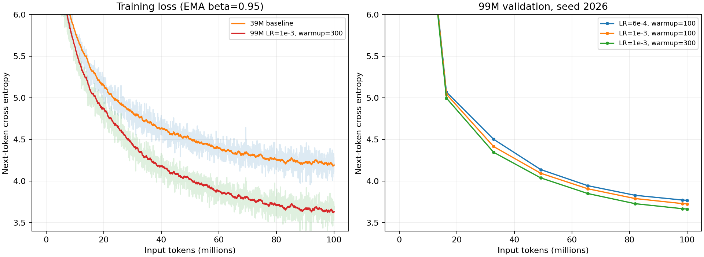

# 本次运行记录

这是一份实际运行台账。初学者可先读 [导读](reading_guide.md) 和 [实验说明](../experiments/README.md)，再核对这里的数值。工程测试通过说明实现可用；短训练 loss 下降说明在学习；聊天能力仍需实际回答与语义评分。三类证据不能互相替代。

2026-10-04，起始 commit：a483269096538609f348cc04a0f23349edbba345。

| 检查 | 本次结果 | 证据 |
|---|---|---|
| GPU 与环境 | PyTorch 2.7.1+cu126，四张 H20，BF16 可用 | logs/bootstrap.log、envs/train.lock.txt |
| CPU 单元与集成测试 | 35 passed，37.50s | logs/tests.log |
| HF 导出对照 | FP32 logits、loss、梯度通过 | tests/unit/model/test_huggingface_export.py |
| DDP 尾部更新 | 两个真实 CPU rank 对照通过，包括空 rank | tests/integration/test_ddp.py |
| M0 tiny overfit | 第 223 step 达到 loss < 0.05；准确率 100% | runs/m00_tiny_overfit/summary.json |
| 扩展测试 | 38 passed，10.84s | logs/tests.log |
| 四张 H20 DDP 更新对照 | 最大参数差异约 9e-8，空 rank 尾部通过 | runs/m03_gpu_correctness/summary.json |
| 四卡 TRL SFT 接口 | 32 个合成会话，训练、验证、模型保存通过 | runs/sft-interface-smoke/summary.json |
| 四卡 BF16 中断恢复 | dropout=0.1、不均匀尾部；RNG 完全一致，参数最大差异 2.91e-11 | runs/m03_ddp_resume/summary.json |
| 四卡 FSDP2 教学对照 | FP32 SGD 更新差异 1.86e-9；Tensor 输出适配层通过 | runs/m03_fsdp/summary.json |
| M1 39M 完整预训练 | 99,999,744 输入 token，3052 更新；验证 loss 10.472692 → 4.219103 | runs/m01_39m/summary.json |
| ModelScope | 私有仓库已创建，根 README 和阶段说明已同步 | [模型仓库](https://modelscope.cn/models/GaiWeiqi/SmallLLMPreTrain-English) |
| 真实 pilot 数据审计 | 300,000 文档指纹、分割及跨来源精确去重通过；Tokenizer 字符往返、特殊 ID 和 assistant mask 通过 | runs/pilot-audit.json |

证据路径相对于远程 `/diff/gaiwq/llm_pretrain`。Tiny overfit 不衡量泛化，当前还没有通过聊天验收的模型。M1 与历史 loss 4.153138 的差异来自本次不同的抽样分片和运行栈，未使用历史验证集。六组 99M 对照已完成；正式预训练、正式 SFT 和能力评测仍待完成。

## 99M 对照与性能实测

每组读取 99,999,744 token，保持数据、模型和更新数一致。下表为本次独立运行的最终验证交叉熵；数值越低越好。

| 学习率 | warmup 更新数 | seed 2026 | seed 2027 |
|---|---:|---:|---:|
| 6e-4 | 100 | 3.769134 | 3.758341 |
| 1e-3 | 100 | 3.725739 | 3.704958 |
| 1e-3 | 300 | 3.664364 | 3.647846 |

两组 seed 均支持较长 warmup 在本次配置中更好；213M 使用新的混合语料和自训 tokenizer，仍需单独调参。这些结果不等同于聊天能力。

曲线从本次 TensorBoard 原始日志生成；训练粗线使用 EMA（0.95），细线保留原始波动。纵轴放大到 3.4–6.0，初始化约 10.5 的 loss 在图外。复绘入口为 `scripts/evaluation/plot_baselines.py`。

213M 四卡 eager 合成数据基准：micro-batch=16/global-batch=256，217,856 输入 token/s，峰值显存约 44.70 GiB/卡。该测量排除了下载、packing、验证和 checkpoint 上传，正式训练预算会留出余量。最新测试为 39 passed；保留 FP32 参数的四卡 BF16 TRL 接口复测也通过（`runs/sft-interface-smoke-v3/summary.json`）。

## 自训 Tokenizer 的 213M pilot

四组均从随机权重训练，读取 99,997,696 token、完成 191 次更新，使用相同混合语料和自训 BPE。

| 学习率 | seed | 最终验证 loss |
|---|---:|---:|
| 3e-4 | 2026 | 5.988814 |
| 6e-4 | 2026 | 6.031944 |
| 1e-3 | 2026 | 6.136201 |
| 6e-4 | 2027 | 6.013090 |

本轮正式训练选择 3e-4，依据见 `runs/lr-selection.json`。与 99M 的编码和语料不同，两个阶段的 loss 数值不能直接比较。

`exports/pilot-base-lr3e4` 已通过 HF 导出和四个纯文本续写样例测试。实际输出重复明显：例如 `Water is important because` 后重复生成 “the little girl” 等故事片段。这是尚未充分训练的 Base，不是合格聊天模型；原始样例保留在 `runs/pilot-completions.json`，后续应检验扩大预训练量和 SFT 是否带来改善。

四卡 SFT 恢复快照接口也已实测通过并上传：`sft-interface-smoke-v4` 含模型、optimizer、scheduler、trainer_state 和四份 RNG。它使用极小合成模型，仅验证接口。最新常规测试为 39 passed（11.46s）。

2026-10-05，原始分片下载、全量清洗、容量统计与 packing 均已完成，四卡正式预训练已开始。训练集实际打包 7,699,996,672 输入 token，验证/测试各 9,496,576 token。70% FineWeb-Edu、25% Cosmopedia、5% TinyStories 的混合比例下，TinyStories 的唯一 token 容量限制了总预算；本轮没有为了凑更大数字而重复数据。设计解释见 [数据实验](../experiments/current/data_tokenizer/README.md) 与 [正式预训练实验](../experiments/current/pretraining/README.md)。

正式训练选择学习率 3e-4、四卡 DDP、BF16 计算与 eager 模式。它仍在运行，尚无正式最终 loss 或聊天验收结论。pilot 模型和样例已同步 ModelScope。下表保留失败、修复与重试历史；过去某一阶段失败不自动表示当前训练失败。

截至第 1000 步，正式训练已读取 524,288,000 输入 token（约预算的 6.8%）。同一验证集 loss 从第 500 步的 4.368060 降至 3.582294；截至第 1007 步的日志 loss/梯度均有限。第 1000 步完整 checkpoint 已保存并确认含优化器、调度器和四份 RNG。这是早期学习与保存状态证据，尚不是最终模型或聊天结论。

## 正式 Base 完成与 SFT 启动故障修复（2026-10-06）

正式预训练已完成全部 7,699,996,672 输入 token、14,687 次更新，耗时约 10.05 小时，最终验证 loss 为 **2.640921**。Base 导出、续写检查与上传完成。这是预训练结果，聊天验收仍待完成。

四组 SFT pilot（各最多 50,000 会话、一轮）与 40 项开发题生成均完成：

| LR | 验证 loss | 开发题结构失败比例 |
|---|---:|---:|
| 1e-5 | 1.533677 | 27.5% |
| 3e-5 | 1.457459 | 20.0% |
| 6e-5 | 1.415538 | 27.5% |
| 1e-4 | 1.395623 | 15.0% |

按预先设定的“结构失败比例，再看验证 loss”选择 1e-4；这些比例不等于语义通过率。

实际生成仍有明显失败：正式 Base 在 “Water is important because” 后续写成 product development 并重复；所选短 SFT pilot 的开发题 dev-02 把 2+1 反复写成 2，却没有触发结构 flags。dev-01 也未遵守两句话限制。原始证据为 runs/base-completions.json、runs/evaluation/dev-3.jsonl。这些反例说明低 loss 和低结构失败比例都不能替代语义评分，正式模型必须独立审阅。

正式 SFT 第一次在开始更新前失败。日志中 rank 0 对 451,821 条会话 tokenize 到约 96% 时已耗时 10:02，其他 rank 的单元素 ALLREDUCE 超过 600 秒等待上限，随后 watchdog 退出。证据支持预处理串行等待超过 NCCL 超时，而不是已经开始训练的梯度通信失败。长度 4434 > 2048 的告警发生在 TRL 截断之前，没有相应的模型越界 traceback；不能把它当作此次超时根因。

修复将全量会话编码与截断移到独立 CPU 阶段（8 workers），生成带 input_ids、assistant_masks 的 Arrow 数据，原子提交 ready.json 并记录文件 SHA-256。训练 rank 校验后读取，使用 TRL skip_prepare_dataset=True，避免在 NCCL 等待期间处理全量文本。数据仍按完整会话去重、截断后有效 assistant 目标过滤、seed=2026 划分 1% 验证；训练/验证数量与失败前一致：451,821 / 4,564。

4 项新回归测试验证截断边界、assistant/padding loss mask、与固定 TRL 0.24.0 编码一致以及损坏文件拒绝加载。全部测试 43 passed（18.51s）；四卡 sft-interface-smoke-v5 已通过训练、验证、保存与四份 RNG 完整恢复快照。正式 SFT 已以原 LR=1e-4 重试，仍待正式结果。原失败日志保留，重试前状态另存 runs/failure-history/。

重试已通过首个真实验证与保存点：第 250 步全量验证 loss=1.511865，checkpoint-250 含模型、optimizer、scheduler、trainer_state 和四份 RNG，文件非空且 PyTorch 容器检查通过。训练继续超过第 281 步，总预算 7060 步（两轮）；这确认修复后的全量四卡任务能完成更新、验证与保存，最终语义结果仍待训练结束。

## 课程迭代与正式训练准备（2026-10-06）

v1 两组短跑已完成，课程末轮总分均 50%；补充逐任务轮次诊断发现上下文均 0%。三组一般开发题实际审阅为原 Chat 10/40、3e-5 6/40、1e-4 2/40。高学习率边界题复核修正已保留，不能把这两候选写成无退化的成功选优。

v2 修正数据偏差、加入 80% 原对话回放；四卡纠正实验已完成 2,500 步，验证 loss 0.134205，一般开发 10/40，合成逐轮上下文仅 1%。随后提交正式两轮、5,000 步的后台启动命令，尚未获得可核验的当前进程/步数回执。120 项新题已冻结，不用于开发选优。完整设计和证据见 [v2 实验](../experiments/current/sft_curriculum_v2/README.md)。

下方自动表为旧控制器历史快照，不能代表课程纠正或正式 v2 的当前状态。

## 最终 v2 语义验收（2026-10-07）

已实际核验：正式 SFT 5,000 步、两轮、160,000 训练会话，运行 4,356.8441 秒，train_loss=1.026046、课程 val_loss=0.130357。读取已生成的最终模型回复，无重复训练或重新生成。

逐题审阅并远程汇总 test：15/120（12.5%），daily 15%、knowledge 20%、instruction 15%、rewrite 15%、summary 10%、context 0%；结构正常率 97.5%，accepted=false。40 dev 单独为 9/40（22.5%）。评分是 Codex 辅助且含边界判断，全部理由与输入哈希保留；不同 test 不能直接作分数趋势比较。

完整结果见 [最终交付](final_delivery.md)。

## 自动阶段进度

| 阶段 | 状态 | 说明 |
|---|---|---|
| engineering-checks | complete | /diff/gaiwq/llm_pretrain/logs/engineering-checks.log |
| lint-checks | complete | /diff/gaiwq/llm_pretrain/logs/lint-checks.log |
| format-checks | complete | /diff/gaiwq/llm_pretrain/logs/format-checks.log |
| download-cosmopedia-pilot | complete | /diff/gaiwq/llm_pretrain/logs/download-cosmopedia-pilot.log |
| download-tinystories-pilot | complete | /diff/gaiwq/llm_pretrain/logs/download-tinystories-pilot.log |
| clean-pilot | complete | /diff/gaiwq/llm_pretrain/logs/clean-pilot.log |
| train-tokenizer | complete | /diff/gaiwq/llm_pretrain/logs/train-tokenizer.log |
| pack-pilot | complete | /diff/gaiwq/llm_pretrain/logs/pack-pilot.log |
| pipeline | awaiting_semantic_review | Automated training and generation finished; semantic acceptance pending. |
| pilot-capacity-fineweb | complete | /diff/gaiwq/llm_pretrain/logs/pilot-capacity-fineweb.log |
| pilot-capacity-cosmopedia | complete | /diff/gaiwq/llm_pretrain/logs/pilot-capacity-cosmopedia.log |
| pilot-capacity-tinystories | complete | /diff/gaiwq/llm_pretrain/logs/pilot-capacity-tinystories.log |
| pilot-previous-attempt | retained | Incomplete packing preserved at /diff/gaiwq/llm_pretrain/data/failed/pilot100m-1791131011 |
| full-data-background | complete | Unique source capacities measured; no repeated-data budget |
| reproduce-baselines | complete | /diff/gaiwq/llm_pretrain/logs/reproduce-baselines.log |
| verify-ddp-resume | complete | /diff/gaiwq/llm_pretrain/logs/verify-ddp-resume.log |
| verify-trl-sft | complete | /diff/gaiwq/llm_pretrain/logs/verify-trl-sft.log |
| verify-four-gpu-ddp | complete | /diff/gaiwq/llm_pretrain/logs/verify-four-gpu-ddp.log |
| verify-fsdp2 | complete | /diff/gaiwq/llm_pretrain/logs/verify-fsdp2.log |
| benchmark-single | complete | /diff/gaiwq/llm_pretrain/logs/benchmark-single.log |
| benchmark-2-gpu | complete | /diff/gaiwq/llm_pretrain/logs/benchmark-2-gpu.log |
| benchmark-4-gpu | complete | /diff/gaiwq/llm_pretrain/logs/benchmark-4-gpu.log |
| verify-compile | failed | /diff/gaiwq/llm_pretrain/logs/verify-compile.log |
| compile-selection | fallback | Eager retained: RuntimeError |
| m04_lr_pilot_0 | complete | /diff/gaiwq/llm_pretrain/logs/m04_lr_pilot_0.log |
| m04_lr_pilot_1 | complete | /diff/gaiwq/llm_pretrain/logs/m04_lr_pilot_1.log |
| m04_lr_pilot_2 | complete | /diff/gaiwq/llm_pretrain/logs/m04_lr_pilot_2.log |
| m04_lr_pilot_3 | complete | /diff/gaiwq/llm_pretrain/logs/m04_lr_pilot_3.log |
| pack-full-data | complete | /diff/gaiwq/llm_pretrain/logs/pack-full-data.log |
| formal-pretraining | complete | /diff/gaiwq/llm_pretrain/logs/formal-pretraining.log |
| export-base | complete | /diff/gaiwq/llm_pretrain/logs/export-base.log |
| base-completion-smoke | complete | /diff/gaiwq/llm_pretrain/logs/base-completion-smoke.log |
| publish-base | complete | /diff/gaiwq/llm_pretrain/logs/publish-base.log |
| download-sft | complete | /diff/gaiwq/llm_pretrain/logs/download-sft.log |
| sft-pilot-0 | complete | /diff/gaiwq/llm_pretrain/logs/sft-pilot-0.log |
| sft-pilot-1 | complete | /diff/gaiwq/llm_pretrain/logs/sft-pilot-1.log |
| sft-pilot-2 | complete | /diff/gaiwq/llm_pretrain/logs/sft-pilot-2.log |
| sft-pilot-3 | complete | /diff/gaiwq/llm_pretrain/logs/sft-pilot-3.log |
| sft-dev-0 | complete | /diff/gaiwq/llm_pretrain/logs/sft-dev-0.log |
| sft-dev-1 | complete | /diff/gaiwq/llm_pretrain/logs/sft-dev-1.log |
| sft-dev-2 | complete | /diff/gaiwq/llm_pretrain/logs/sft-dev-2.log |
| sft-dev-3 | complete | /diff/gaiwq/llm_pretrain/logs/sft-dev-3.log |
| formal-sft | complete | /diff/gaiwq/llm_pretrain/logs/formal-sft.log |
| prepare-formal-sft-data | complete | /diff/gaiwq/llm_pretrain/logs/prepare-formal-sft-data.log |
| publish-chat | complete | /diff/gaiwq/llm_pretrain/logs/publish-chat.log |
| final-chat-generation | complete | /diff/gaiwq/llm_pretrain/logs/final-chat-generation.log |
| evaluation-environment | complete | /diff/gaiwq/llm_pretrain/logs/evaluation-environment.log |
| evaluation-torch | complete | /diff/gaiwq/llm_pretrain/logs/evaluation-torch.log |
| evaluation-dependencies | complete | /diff/gaiwq/llm_pretrain/logs/evaluation-dependencies.log |
| lm-eval-base | complete | /diff/gaiwq/llm_pretrain/logs/lm-eval-base.log |
| lm-eval-chat | complete | /diff/gaiwq/llm_pretrain/logs/lm-eval-chat.log |
| inference-environment | complete | /diff/gaiwq/llm_pretrain/logs/inference-environment.log |
| install-vllm | complete | /diff/gaiwq/llm_pretrain/logs/install-vllm.log |
| vllm-offline-smoke | complete | /diff/gaiwq/llm_pretrain/logs/vllm-offline-smoke.log |
| pin-inference-tokenizer-v1 | complete | /diff/gaiwq/llm_pretrain/logs/pin-inference-tokenizer-v1.log |
| inference-dependency-check | complete | /diff/gaiwq/llm_pretrain/logs/inference-dependency-check.log |
| inference-tokenizer-preflight | complete | /diff/gaiwq/llm_pretrain/logs/inference-tokenizer-preflight.log |
| vllm-service-smoke | complete | /diff/gaiwq/llm_pretrain/logs/vllm-service-smoke.log |
| first-week-delivery | awaiting_semantic_review | Model/export/evaluation produced. Review 120 answers before declaring capability acceptance. |
